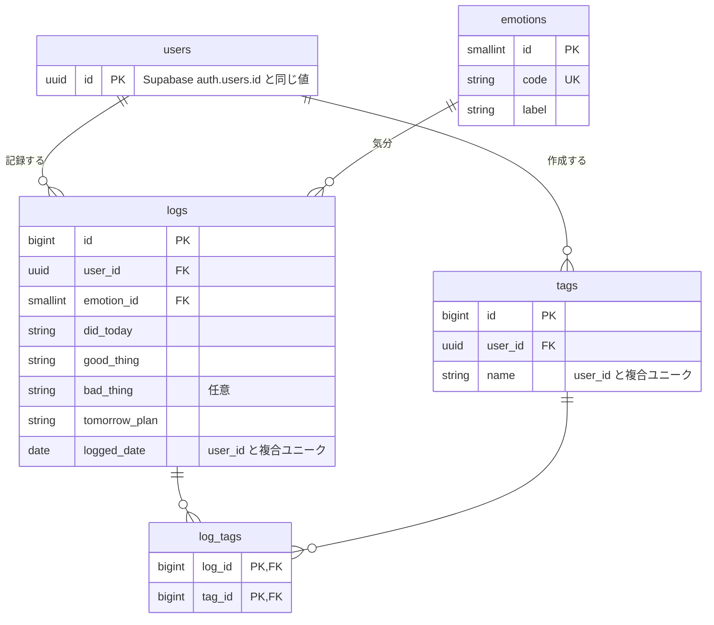

# エモログ（emolog）

ゲームのプレイ記録を「やったこと／良かったこと／モヤモヤしたこと／明日やること」の4項目と気分・タグで、1日1件ずつ残していく記録アプリです。
記録を続けると、連続記録日数・感情の内訳・気分の推移が自動で集計され、自分のコンディションの傾向を振り返れます。

## デモ

- **URL**: <!-- TODO: デプロイ先URL --> https://xxxxx.vercel.app
- **デモアカウント**

  | 項目 | 値 |
  |---|---|
  | メールアドレス | <!-- TODO --> `demo@example.com` |
  | パスワード | <!-- TODO --> `xxxxxxxx` |

> デモアカウントには動作確認用のサンプル記録が入っています。自由に追加・編集・削除して構いません。

## 要件定義

### 背景・目的

ゲームを長く遊んでいると、「今日は何をして、どう感じたか」は数日で忘れてしまいます。
エモログは、毎日の振り返りを **短い4項目＋気分** という決まった型で残すことで、記録のハードルを下げ、あとから感情の傾向を見返せるようにすることを目的としています。

### 想定ユーザー

- ゲームを日常的にプレイし、上達や気分の波を振り返りたい人
- 日記は続かないが、決まったフォーマットなら記録できる人

### ユーザーストーリー

- ユーザーとして、**今日の振り返りを1分以内に入力したい**。習慣として続けられるようにするため
- ユーザーとして、**気分を選んで記録したい**。あとから感情の傾向を見返すため
- ユーザーとして、**記録にタグを付けたい**。ゲームタイトルやコンテンツごとに振り返るため
- ユーザーとして、**書き忘れた日の記録をあとから追加したい**。記録の抜けを埋めるため
- ユーザーとして、**連続記録日数を見たい**。記録を続けるモチベーションにするため
- ユーザーとして、**期間ごとの感情の内訳や推移を見たい**。調子の良し悪しの傾向をつかむため

### 機能要件・非機能要件

| 区分 | 内容 |
|---|---|
| 記録 | 1ユーザーにつき1日1件（同じ日の重複登録は不可） |
| 入力 | 「やったこと」「良かったこと」「明日やること」は必須、「モヤモヤしたこと」は任意 |
| 認証 | ログインしたユーザーだけが自分の記録を閲覧・操作できる |
| バリデーション | クライアントとサーバーの両方で同じスキーマ（zod）を使って検証する |
| レスポンシブ | スマホ（375px）〜PC（1440px）に対応する。モバイルファーストで実装する |

## 機能一覧

| 画面 | 機能 |
|---|---|
| 認証 | メールアドレス＋パスワードでの新規登録・ログイン |
| | Googleアカウントでのログイン（OAuth） |
| | ログアウト、未ログイン時のアクセス制限 |
| ホーム（`/`） | 連続記録日数・今月の記録件数・直近の気分の表示 |
| | 直近7日間の記録状況の表示 |
| 記録する（`/post`） | 4項目＋気分＋タグで今日の記録を作成 |
| | タグの選択・その場での新規作成 |
| | 過去の日付の記録を追加（カレンダーから） |
| | 保存完了のトースト通知 |
| 一覧（`/logs`） | カレンダーで記録した日と気分を一覧表示 |
| | 記録の詳細表示（PCでは一覧と詳細を2ペインで同時に表示） |
| | 記録の編集・削除 |
| 分析（`/analytics`） | 集計期間の切り替え（1週間／1ヶ月／3ヶ月） |
| | 感情の内訳の表示 |
| | 気分スコアの推移グラフ |

## 使用技術

### フレームワーク・言語

| 技術 | バージョン | 用途 |
|---|---|---|
| [Next.js](https://nextjs.org/)（App Router） | 16.3 | フロントエンド・APIルート |
| [React](https://react.dev/) | 19.2 | UI |
| [TypeScript](https://www.typescriptlang.org/) | 5 | 型安全な開発 |

### 主なライブラリ

| ライブラリ | 用途 |
|---|---|
| [Tailwind CSS](https://tailwindcss.com/) v4 | スタイリング |
| [shadcn/ui](https://ui.shadcn.com/)（Base UI） | UIコンポーネント |
| [Prisma](https://www.prisma.io/) v7 | ORM（`@prisma/adapter-pg` によるドライバーアダプター方式） |
| [React Hook Form](https://react-hook-form.com/) | フォームの状態管理 |
| [Zod](https://zod.dev/) v4 | バリデーション（クライアント・サーバーで共通のスキーマ） |
| [Recharts](https://recharts.org/) | 分析画面のグラフ |
| [Sonner](https://sonner.emilkowal.ski/) | トースト通知 |
| [lucide-react](https://lucide.dev/) | アイコン |
| [@supabase/ssr](https://supabase.com/docs/guides/auth/server-side) | Next.js でのセッション管理（Cookie） |

### インフラ・外部サービス／API

| サービス | 用途 |
|---|---|
| [Supabase Auth](https://supabase.com/docs/guides/auth) | ユーザー認証（メール＋パスワード） |
| [Google OAuth 2.0](https://developers.google.com/identity/protocols/oauth2)（Supabase Auth経由） | Googleアカウントでのログイン |
| [Supabase Database](https://supabase.com/docs/guides/database)（PostgreSQL） | 記録・タグ・感情マスタの保存 |
| <!-- TODO: デプロイ先 --> Vercel | ホスティング |

## ER図



## ローカルでの起動方法

```bash
# 1. 依存パッケージのインストール（postinstall で prisma generate も実行されます）
npm install

# 2. 環境変数の設定（.env を作成）
#   DATABASE_URL                          Supabase の接続文字列（pooler）
#   SUPABASE_URL / SUPABASE_PUBLISHABLE_KEY
#   NEXT_PUBLIC_SUPABASE_URL / NEXT_PUBLIC_SUPABASE_PUBLISHABLE_KEY

# 3. マイグレーションと感情マスタの投入
npx prisma migrate deploy
npx prisma db seed

# 4. 開発サーバーの起動
npm run dev
```

[http://localhost:3000](http://localhost:3000) を開くとアプリが表示されます。

## 今後の予定

- AIによる感情傾向の要約（ホーム・分析画面）
- 一覧画面の週ごと・月ごとの表示
- 記録の検索
- 分析画面のポジティブ率の表示
